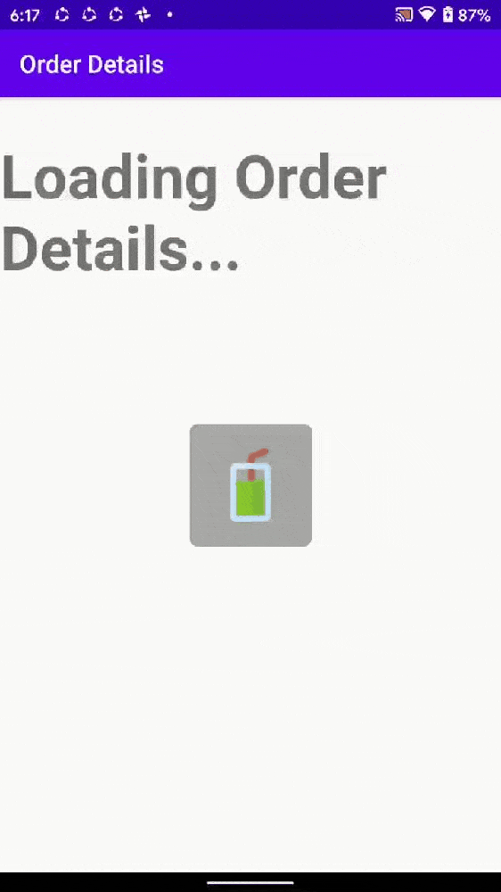

[](https://jitpack.io/#hamzamadoo/DynamicImageProgress-Lib)


***
# Multiple Images progress Dynamically
***

This Lib is designed to cater the demand of such ImageView , which can display multiple images sequentially (one after another) at particular interval.

### This can be used as
<B>

1. Progress Loader
2. Splash Screen Background
3. Simple Loader
4. Wherever you want :)

</B>


## Installation

Add Jitpack to your project build.gralde file

````      
      allprojects {
		repositories {
			...
			maven { url 'https://jitpack.io' }
		}
	}
}
````
Then add this dependency to your app build.gradle file.
````
      dependencies {
	        implementation 'com.github.hamzamadoo:DynamicImageProgress-Lib:latest-release'
	}
````

***
## Screenshots with Code

### 1. On Splash Screen as Background


#### xml
````
<com.hamzamadoo.imageprogress.MultiImageProgress
        android:id="@+id/imgAvengers"
        android:layout_width="match_parent"
        android:layout_height="match_parent"
        android:scaleType="centerCrop"
        app:delay="300"
        app:period="300"
        app:layout_constraintBottom_toBottomOf="parent"
        app:layout_constraintLeft_toLeftOf="parent"
        app:layout_constraintRight_toRightOf="parent"
        app:layout_constraintTop_toTopOf="parent"
        android:src="@drawable/iron_man" /> 
````

#### kotlin

````
class SplashActivity : AppCompatActivity() {

    private val avengers by lazy {
        listOf(R.drawable.caiptan_america,R.drawable.hulk,R.drawable.ant_man,
            R.drawable.groot,R.drawable.iron_man)
    }
    override fun onCreate(savedInstanceState: Bundle?) {
        super.onCreate(savedInstanceState)
        setContentView(R.layout.activity_splash)
        imgAvengers.init(avengers)
        imgAvengers.startProgress()
    }
}
````


### 2. On Splash Screen as Progress


#### xml
````
<com.hamzamadoo.imageprogress.MultiImageProgress
        android:id="@+id/imgProgress"
        android:layout_width="60dp"
        android:layout_height="60dp"
        android:layout_alignParentBottom="true"
        android:layout_centerHorizontal="true"
        android:layout_marginBottom="60dp"
        android:src="@drawable/burger"
        app:delay="300"
        app:period="300"
        app:startOnInit="true" />
````
#### kotlin
````
class ProgressActivity : AppCompatActivity() {

    private val food by lazy {
        listOf(
            R.drawable.coffee,
            R.drawable.hotdog, R.drawable.pizza, R.drawable.sandwich, R.drawable.soda,
            R.drawable.burger
        )
    }

    override fun onCreate(savedInstanceState: Bundle?) {
        super.onCreate(savedInstanceState)
        setContentView(R.layout.activity_progress)
        imgProgress.init(food)
    }
}
````


### 3. To Halt UI while Background Process (API/DB operations) is running


#### xml
````
<FrameLayout
        android:layout_width="100dp"
        android:layout_height="100dp"
        android:background="@drawable/shape_loader_bg"
        app:layout_constraintBottom_toBottomOf="parent"
        app:layout_constraintLeft_toLeftOf="parent"
        app:layout_constraintRight_toRightOf="parent"
        app:layout_constraintTop_toTopOf="parent">

        <com.hamzamadoo.imageprogress.MultiImageProgress
            android:id="@+id/imgProgress"
            android:layout_width="60dp"
            android:layout_height="60dp"
            android:layout_gravity="center"
            app:delay="500"
            app:period="500"
            app:startOnInit="true"
            android:src="@drawable/burger"/>
    </FrameLayout>
````
#### kotlin
````
class LoaderActivity : AppCompatActivity() {

    private val food =
        listOf(
            R.drawable.coffee,
            R.drawable.hotdog, R.drawable.pizza, R.drawable.sandwich, R.drawable.soda,
            R.drawable.burger
        )


    override fun onCreate(savedInstanceState: Bundle?) {
        super.onCreate(savedInstanceState)
        setContentView(R.layout.activity_loader)
        supportActionBar?.title = "Order Details"
        imgProgress.init(food)
    }
}
````


## Usage
1. As this is multi image loader, provide at least two images.
2. By default The Delay and Period (For Image loading is 1000ms)<br>
These value can be changed via xml
````
app:delay="500"
app:period="500"
````
3. array of drawable ids (array of images) can be supplied to MultiImageProgress via init method<br>
````
private val food =
        listOf(
            R.drawable.coffee,
            R.drawable.hotdog, R.drawable.pizza, R.drawable.sandwich, R.drawable.soda,
            R.drawable.burger
        )
        
 ````
 <br>

 ````
imgProgress.init(food)
````

4. There are two ways to start dynamic image loading<br>
    <ol>
    <li> <b>As soon as init() function gets called ~ Automatically:</b><br>
    automatic image loading can be started by setting "app:startOnInit" property to True<br><b>app:startOnInit="true"</b></li> 
    <li><b> By calling startProgress() function ~ Manually:</b><br>
    Manual image loading can be started by calling startProgress() on MultiImageProgress<br><b>imgProgress.startProgress()</b></li>
</ol>

5. Dynamic image loading can be stopped (if required) by calling stopProgress on MultiImageProgress <br>
<b>imgProgress.stopProgress()</b>
